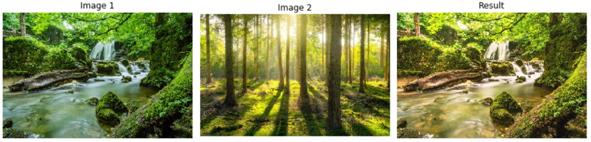

# Projeto DIO: Pacote de Processamento de Imagens em Python

### Autora: Karina Kato
### Disponível em: https://pypi.org/project/wallet-python-pacotes-imagens/
### Repositório de exemplos do template: https://github.com/tiemi/

---

## Descomplicando a criação de pacotes de processamento de imagens em Python

### O pacote "image_processing" é usado para:

Módulo "Processing":
- Correspondência de histograma;
- Similaridade estrutural;
- Redimensionar imagem;

Módulo "Utils":
- Ler imagem;
- Salvar imagem;
- Plotar imagem;
- Plotar gráfico;
- Plotar histograma;

### Resultado do processamento:

